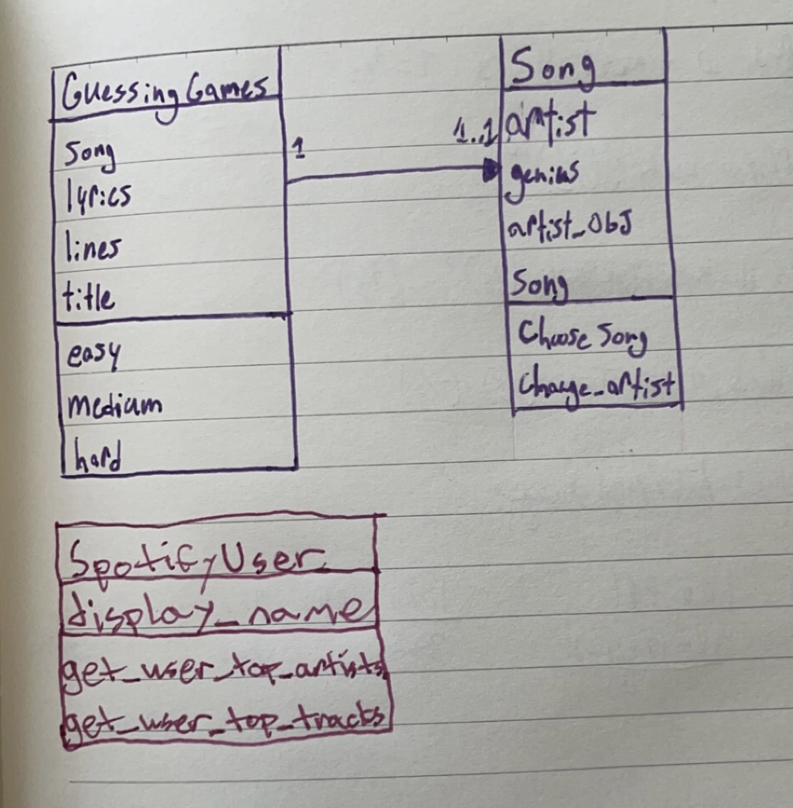

# Project Schedule
[Project Schedule Google Doc](https://docs.google.com/document/d/10tnOg8KHfubyNcZCi7PBRFNAf76mslNitxwFQazbzAs/edit)

# Project Notes
[Project Notes Google Doc](https://docs.google.com/document/d/1NXpK9OvyxsLzajeomOTyXSqDQzA0lvrBeQZMqZY2CDU/edit?usp=sharing)

# Class Diagram

# Purpose
The overall project is a fun, interactive guessing game that challenges users to identify missing words or song titles
based on lyrics from their favorite artists. The purpose of this project is to use an API to get lyrics from the
internet, all for the goal of making a guessing game. We wanted to allow users to guess different lyrics from songs they
listen to, as well as automate the song selection process. User interaction includes authorizing their Spotify account
and providing answers to the lyric-based guessing games. The output consists of displaying the user's top artists and
tracks, lyrics with missing words or song titles, and feedback on the user's guesses. Ultimately this project is for the
pursuit of fun!

# Approach
We used two different APIs, the Spotify API and the Genius API. While doing research we discovered that there were
pre-established libraries which could help us utilize our chosen APIs. Isaac used the lyricsgenius library, which
allowed us to search for an artist's songs and lyrics. Nico used the Spotify API, which allowed us to retrieve a user's
most listened to artists. We also used the requests library, which facilitates making HTTP requests to the APIs, as well
as the requests-OAuthlib library, which assists in OAuth2 authentication with Spotify.
